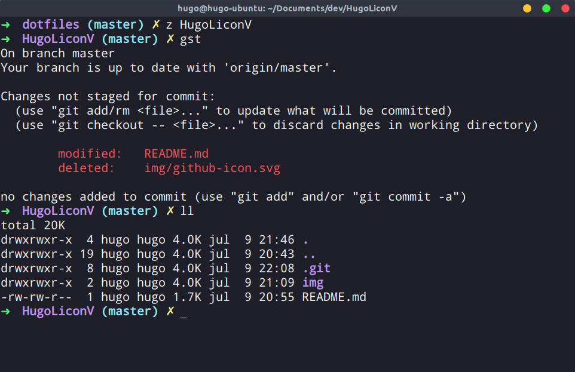
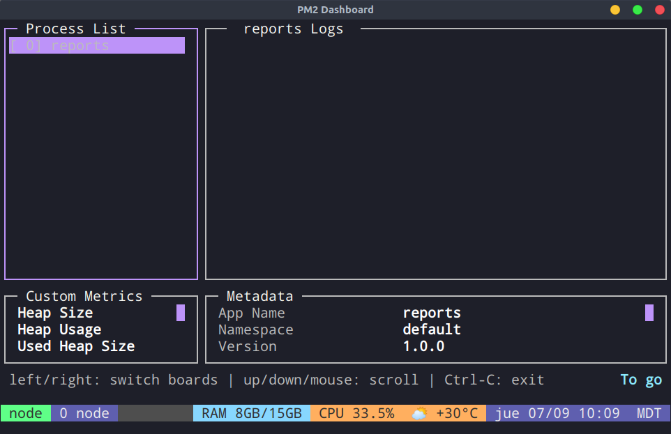
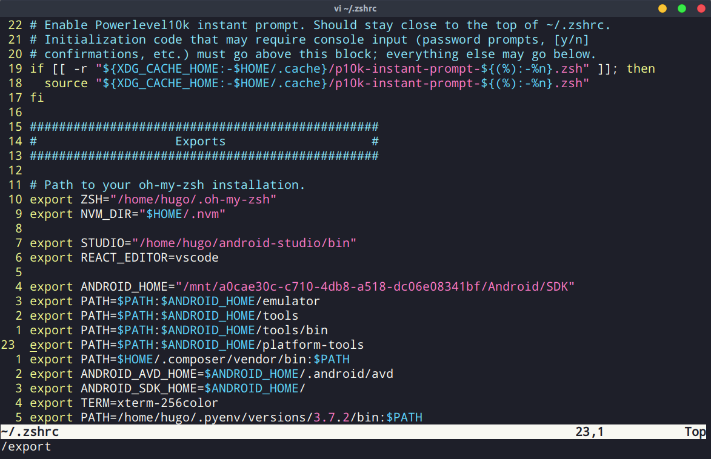

# dotfiles
Compilation of all of my dotfiles

## Installation
Clone repository.

```bash
git clone https://github.com/HugoLiconV/dotfiles.git
```

### Setup Vim
```bash
ln -s ~/dotfiles/.tmux.conf ~/.tmux.conf
```

### Install tmux
```bash
brew install tmux
```

Create Symlink
```bash
ln -s ~/dotfiles/.tmux.conf ~/.tmux.conf
```

### Install Tmux Plugin Manager (tpm)
```bash
git clone https://github.com/tmux-plugins/tpm ~/.tmux/plugins/tpm
```
Install plugins
1. Press `prefix` + `I` (Capital i, as in Install). The prefix is `Ctrl + a`


### Install Oh My Zsh
```bash
sh -c "$(curl -fsSL https://raw.githubusercontent.com/ohmyzsh/ohmyzsh/master/tools/install.sh)"
```

Create Symlink
```bash
# Remove default .zshrc file
rm ~/.zshrc
# Create a symlink
ln -s ~/dotfiles/.zshrc ~/.zshrc
```

Install Dracula Theme
```bash
git clone https://github.com/dracula/zsh.git
# Create a symbolic link to oh-my-zsh's theme folder:
ln -s ~/zsh/dracula.zsh-theme ~/.oh-my-zsh/themes/dracula.zsh-theme
```

Install zsh-autosuggestions
```bash
git clone https://github.com/zsh-users/zsh-autosuggestions ${ZSH_CUSTOM:-~/.oh-my-zsh/custom}/plugins/zsh-autosuggestions
```

## Screenshots

###  Terminator


### Tmux


### Vim

